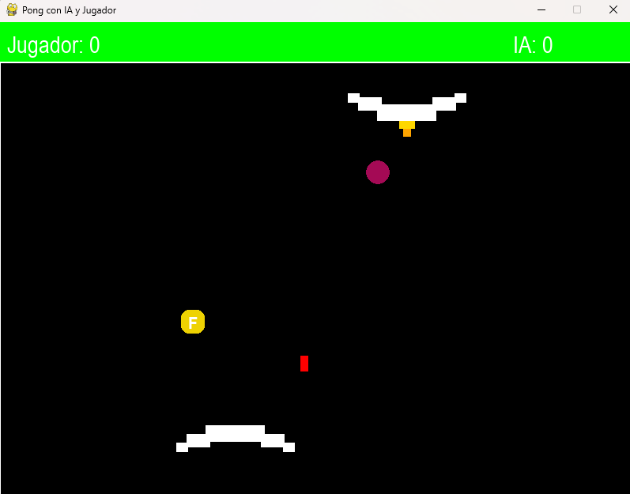

# Pong Vs IA 
Un **Pong single-player** hecho con **Python + Pygame**, montado como experimento para aprender el patrón **ECS (Entity Component System)**.

La gracia del juego es que **juegas contra una IA bastante chetada**, pero durante la partida aparecen **power-ups aleatorios** que puedes coger tú o la IA. Si pillas uno en buen momento, puedes darle la vuelta a la partida.


---

## 🎮 Gameplay rápido

- Tu paddle (abajo) se controla con el **ratón**.
- La IA (arriba) sigue la bola con un pequeño “offset” para no ser perfecta.
- Gana el primero que llegue a **5 puntos**.
- Si sale un **power-up**, lo recoge quien toque la bola justo al colisionar con él (depende del último paddle que golpeó la bola).

---

## 🕹️ Controles

- **Ratón** → mover el paddle del jugador.
- **ESPACIO** → disparar si tienes el **Cañón** activo.
- **F5** → activar/desactivar modo debug (hitboxes).
- **ENTER** → reiniciar cuando termine la partida.
- Cerrar ventana → salir.

---

## 🔥 Power-ups

Aparecen aleatoriamente cada pocos segundos, duran un rato en pantalla y parpadean cuando están a punto de desaparecer.

- **F (Freeze)**: congela al rival un momento con un efecto eléctrico.
- **S (Slow)**: ralentiza al rival temporalmente con un efecto de caracol.
- **W (Width)**: ensancha tu paddle durante unos segundos.
- **C (Cannon)**: te da un cañón temporal para disparar una bala y romper bloques del rival hasta que alguno marque punto.

---

## 🧠 Cosas curiosas del proyecto

- El **paddle está compuesto por 5 bloques** (y se puede “romper”).
- La bola cambia de color en rebotes, y aumenta la velocidad con el tiempo (hasta un límite).
- Hay un efecto visual tipo “ondas” cuando se marca punto.
- Todo está organizado como “entidades” que se actualizan dentro de un **ControlSystem**, intentando mantener una mentalidad ECS.

---

## ✅ Jugar directamente (Windows)

Si solo quieres jugar:

1. Entra en la carpeta `dist/`
2. Ejecuta:

**`PongVsIA.exe`**

---

## 🧱 Requisitos para ejecutar desde código

- **Python 3.10+**
- **pygame**

Instalar dependencias:

```bash
pip install pygame
